# 🏛️ Ekosistem Simokerto PINTAR

<div align="center">
  
  
  **Pelayanan Informasi Terpadu dan Responsif Kelurahan Simokerto**
  
  *Mendigitalkan pelayanan masyarakat dengan teknologi terdepan - Ekosistem 3 Aplikasi Terintegrasi*

  [](https://nextjs.org/)
  [](https://flutter.dev/)
  [](https://www.typescriptlang.org/)
  [](https://www.mysql.com/)
  [](https://github.com)
  [](https://github.com)

</div>

---

## 🌟 Tentang Ekosistem

**Simokerto PINTAR** adalah ekosistem digital komprehensif yang terdiri dari **3 aplikasi terintegrasi** untuk memenuhi kebutuhan digitalisasi pelayanan kelurahan yang modern, efisien, dan user-friendly.

### 🏗️ Arsitektur Ekosistem

```mermaid
graph TB
    A[📱 Aplikasi Warga<br/>Flutter Mobile App] --> D[🌐 Dashboard Web Admin<br/>Next.js Web App]
    B[📱 Aplikasi Petugas<br/>Flutter Mobile App] --> D
    C[👥 Masyarakat] --> A
    E[👮 Petugas Lapangan] --> B
    F[🏛️ Admin Kelurahan] --> D
    
    D --> G[(🗄️ MySQL Database)]
    D --> H[🔔 Real-time Notifications]
    D --> I[📊 Analytics & Reports]
```



---

## 📱 Aplikasi dalam Ekosistem

### 1. � **Dashboard Web Admin** (Repository Ini)
> **Platform**: Next.js Web Application  
> **Target User**: Admin Kelurahan, Superadmin, Petugas  
> **Status**: ✅ **Aktif & Stabil** (56+ commits)

**Fitur Utama**:
- **Real-time Analytics Dashboard** dengan grafik interaktif
- **Multi-role Management** (superadmin, admin1, admin2, petugas)  
- **Comprehensive Reporting System** dengan status tracking
- **Advanced Security** (bcrypt, rate limiting, CSRF protection)
- **Activity Audit Logging** untuk compliance
- **Responsive Design** untuk semua perangkat

### 2. � **Aplikasi Warga** - [Lapor Maling App V2](https://github.com/Vanszs/Flutter_Aplikasi_Pintar_Kelurahan)
> **Platform**: Flutter Mobile Application  
> **Target User**: Masyarakat/Warga Kelurahan  
> **Status**: ✅ **Aktif** (v2.0.0)

**Fitur Unggulan**:
- **🔄 Offline/Online State Management** - Sistem robust untuk mode offline
- **📊 Smart Reporting** - Form pelaporan intelligent dengan validasi
- **🔐 Secure Authentication** - Token-based dengan auto-refresh  
- **🎨 Modern UI/UX** - Material Design 3 dengan smooth animations
- **🌐 Real-time Sync** - Sinkronisasi otomatis saat online kembali
- **📱 Cross-platform** - Support Android, iOS, dan Web

### 3. � **Aplikasi Petugas** - [Simokerto PINTAR Petugas](https://github.com/Vanszs/Aplikasi_Pintar_Petugas) 
> **Platform**: Flutter Mobile Application  
> **Target User**: Petugas Lapangan, RT/RW  
> **Status**: ✅ **Aktif** (v2.1.0+3 - 53+ commits)

**Fitur Spesialis**:
- **🔔 Real-time Push Notifications** via Firebase FCM
- **📊 Field Dashboard** dengan monitoring laporan
- **📱 Report Management** - Update status, tambah komentar
- **👥 User Management** - Informasi pelapor dan statistik
## ✨ Fitur Unggulan Dashboard Web

#### 🎯 **Dashboard Interaktif**
- **Real-time Analytics** - Statistik laporan dan aktivitas secara langsung
- **Modern UI/UX** - Desain responsif dengan Material Design 3
- **Dark/Light Mode** - Tema yang dapat disesuaikan dengan preferensi pengguna
- **Mobile-First** - Optimized untuk semua perangkat

#### 👥 **Manajemen Pengguna Multi-Role**
- **4 Level Akses**: Superadmin, Admin1, Admin2, Petugas
- **Profile Management** - Kelola data pribadi dan informasi petugas
- **Activity Tracking** - Comprehensive audit trail semua aktivitas
- **Bulk Operations** - Operasi massal untuk efisiensi administratif

#### 📋 **Sistem Pelaporan Terintegrasi**
- **Central Report Management** - Kelola laporan dari 2 aplikasi mobile
- **Status Tracking** - Pelacakan status laporan secara real-time
- **Document Management** - Organisasi bukti dan dokumen pendukung  
- **Analytics & Insights** - Laporan statistik dan trend analysis

#### 🔐 **Keamanan Enterprise-Grade**
- **Bcrypt Password Hashing** - Password di-hash dengan bcrypt salt 12 rounds
- **Secure Session Management** - Session dengan expiry dan signature validation
- **SQL Injection Protection** - Parameterized queries untuk semua database operations
- **Rate Limiting** - Perlindungan terhadap brute force attacks (5 attempts/15min)
- **CSRF Protection** - Token-based CSRF protection untuk form sensitif
- **Role-Based Access Control** - Kontrol akses berdasarkan peran yang ketat
- **Input Validation** - Validasi dan sanitasi semua input pengguna
- **Secure Headers** - HTTP security headers untuk mencegah XSS dan clickjacking
- **Activity Logging** - Comprehensive audit trail untuk semua aktivitas pengguna

---

## 🔗 Integrasi Antar Aplikasi

### 📊 **Data Flow & Communication**


### 🔄 **Real-time Features**
- **WebSocket Integration** - Live updates across all platforms
- **Push Notifications** - Firebase FCM untuk mobile apps
- **Auto-refresh** - Data sinkronisasi otomatis setiap 30 detik
- **Offline Support** - Mode offline dengan sinkronisasi saat online kembali

---

## 🏗️ Teknologi Stack Ekosistem

### 🌐 **Web Dashboard (Repository Ini)**
```typescript
Next.js 15.0           // React Framework dengan App Router  
TypeScript 5.0         // Type-safe JavaScript
Material-UI 5.0        // Component Library dengan theming
MySQL 8.0              // Relational Database
bcryptjs               // Password hashing (12 rounds)
Rate Limiting          // Brute force protection
WebSocket/Socket.IO    // Real-time communication
```

### 📱 **Mobile Applications**
```dart
Flutter 3.0+           // Cross-platform mobile framework
Dart 3.0+              // Programming language
Riverpod               // State management untuk React-like patterns
Firebase FCM           // Push notifications & analytics  
Socket.IO              // Real-time bidirectional communication
Shared Preferences     // Local data persistence
Connectivity Plus      // Network state monitoring
```

### 🔧 **Infrastructure & DevOps**
```bash
MySQL 8.0              # Primary database dengan replication
Node.js 18+            # Runtime environment untuk backend
Firebase               # Push notifications & analytics
WebSocket              # Real-time communication protocol
SSL/TLS                # End-to-end encryption
Rate Limiting          # DDoS & brute force protection
```

---

## 🚀 Quick Start - Setup Ekosistem

### 📋 Prasyarat Sistem
```bash
# Web Dashboard
Node.js >= 18.0.0
MySQL >= 8.0
npm atau yarn

# Mobile Apps  
Flutter SDK >= 3.0.0
Dart SDK >= 3.0.0
Android Studio / VS Code
Firebase Project (untuk notifications)
```

### 🌐 **Setup Web Dashboard** (Repository Ini)

#### 1️⃣ Clone Repository
```bash
git clone https://github.com/Vanszs/Luaran_Website_Keluarahan_Simokerto.git
cd Luaran_Website_Keluarahan_Simokerto
```

#### 2️⃣ Install Dependencies
```bash
npm install
# Dependencies: bcryptjs, mysql2, rate-limiter-flexible, dll
```

#### 3️⃣ Setup Environment & Database
```bash
cp .env.example .env.local
```

Edit `.env.local`:
```env
# Database Configuration
MYSQL_HOST=localhost
MYSQL_PORT=3306
MYSQL_DATABASE=lapor_maling
MYSQL_USER=your_username
MYSQL_PASSWORD=your_password

# Security
SESSION_SECRET=your-super-secret-session-key-minimum-32-characters
NODE_ENV=development

# Application
NEXT_PUBLIC_APP_NAME="Dashboard Pintar Simokerto"
NEXT_PUBLIC_APP_VERSION="2.0.0"
```

#### 4️⃣ Setup Database & Migration
```bash
# Import database structure
mysql -u your_username -p lapor_maling < sql/lapor_maling.sql

# Create activity logs table untuk audit trail
mysql -u your_username -p lapor_maling < sql/create-activity-logs-table.sql

# Migrate existing passwords ke bcrypt hash (PENTING!)
npm run migrate:passwords
```

#### 5️⃣ Run Development Server
```bash
npm run dev
# Server akan berjalan di http://localhost:3000
```

### 📱 **Setup Mobile Applications**

#### 🏠 **Aplikasi Warga** - [Repository Flutter](https://github.com/Vanszs/Flutter_Aplikasi_Pintar_Kelurahan)
```bash
# Clone repository
git clone https://github.com/Vanszs/Flutter_Aplikasi_Pintar_Kelurahan.git
cd Flutter_Aplikasi_Pintar_Kelurahan

# Install dependencies
flutter pub get

# Setup Firebase (opsional, untuk analytics)
# Download google-services.json ke android/app/

# Run aplikasi
flutter run
```

#### 👮 **Aplikasi Petugas** - [Repository Flutter](https://github.com/Vanszs/Aplikasi_Pintar_Petugas)
```bash
# Clone repository  
git clone https://github.com/Vanszs/Aplikasi_Pintar_Petugas.git
cd Aplikasi_Pintar_Petugas

# Install dependencies
flutter pub get

# Setup Firebase untuk push notifications
# Download google-services.json (Android) dan GoogleService-Info.plist (iOS)

# Generate launcher icons
flutter pub run flutter_launcher_icons:main

# Run aplikasi
flutter run
```

### 🔗 **Koneksi Antar Aplikasi**
Pastikan semua aplikasi terhubung ke server yang sama:

```dart
// Konfigurasi di aplikasi mobile
const String serverUrl = 'http://your-server-ip:3000';
const String webDashboardUrl = 'http://your-server-ip:3000';
```

🎉 **Ekosistem Simokerto PINTAR siap digunakan!**

---

---

## 🔐 Security Features

### Password Security
- **Bcrypt Hashing**: Semua password di-hash dengan bcrypt salt 12 rounds
- **Password Strength**: Validasi minimum 8 karakter dengan kombinasi huruf, angka, dan simbol
- **Migration Script**: Script otomatis untuk migrasi password lama ke format hash

### Session Management
- **Secure Sessions**: Session dengan timestamp dan signature validation
- **Auto Expiry**: Session otomatis expired setelah 7 hari
- **Edge Runtime Compatible**: Session management yang kompatibel dengan Next.js Edge Runtime

### Input Security
- **SQL Injection Protection**: Semua query menggunakan parameterized statements
- **XSS Prevention**: Input sanitization dan output encoding
- **CSRF Protection**: Token-based protection untuk form sensitif

### Access Control
- **Role-Based Authorization**: 4 level akses (superadmin, admin1, admin2, petugas)
- **Route Protection**: Middleware yang memvalidasi akses berdasarkan role
- **API Security**: Endpoint protection dengan session validation

### Rate Limiting
- **Login Protection**: Rate limiting untuk mencegah brute force attack
- **IP-based Limiting**: Pembatasan request per IP address
- **Configurable Limits**: Rate limits yang dapat dikonfigurasi

---

## 📱 Screenshots

<div align="center">

### 🖥️ Desktop Dashboard


### 📱 Mobile Responsive


### 🌙 Dark Mode


</div>

---

## 🗂️ Struktur Proyek

```
📦 dashboard-pintar-simokerto/
├── 📁 app/                    # Next.js App Router
│   ├── 📁 admin/             # Admin pages (superadmin)
│   ├── 📁 admin2/            # Admin2 pages (secondary admin)
│   ├── 📁 dashboard/         # Admin1 dashboard
│   ├── 📁 petugas/           # Petugas dashboard
│   ├── 📁 api/              # API routes
│   │   ├── 📁 auth/         # Authentication endpoints
│   │   └── 📁 admin/        # Admin API endpoints
│   └── 📄 layout.tsx        # Root layout
├── 📁 components/            # Reusable components
│   ├── 📁 admin/            # Admin-specific components
│   ├── 📁 layout/           # Layout components
│   └── � ProtectedRoute.tsx # Route protection component
├── 📁 contexts/             # React contexts
│   └── 📄 AuthContext.tsx   # Authentication context
├── 📁 hooks/                # Custom hooks
├── 📁 utils/                # Utility functions
│   ├── � db.ts            # Database utilities
│   ├── 📄 sessionUtils.ts   # Session management
│   ├── 📄 rateLimiter.ts    # Rate limiting
│   └── 📄 activityLogger.ts # Activity logging
├── �📁 scripts/              # Utility scripts
│   └── 📄 migrate-existing-passwords.js # Password migration
├── 📁 sql/                  # Database schemas
├── 📁 styles/               # Global styles
├── 📁 public/               # Static assets
├── � middleware.ts         # Next.js middleware for auth
└── 📄 next.config.js        # Next.js configuration
```

---

## 🔧 Scripts & Commands

```bash
# Development
npm run dev              # Start development server
npm run build           # Build for production
npm run start           # Start production server

# Database
npm run migrate:passwords # Migrate existing passwords to bcrypt

# Security
npm audit               # Check for security vulnerabilities
npm audit fix           # Fix security issues automatically

# Code Quality
npm run lint            # Run ESLint
npm run format          # Format code with Prettier
```

---

## 🎨 Design System

### 🎨 Color Palette
```scss
// Primary Colors
$primary-blue: #3b82f6;
$primary-purple: #8b5cf6;

// Status Colors
$success: #10b981;    // Completed/Active
$warning: #f59e0b;    // Processing/Pending
$error: #ef4444;      // Rejected/Error
$info: #06b6d4;       // Information

// Neutral Colors
$gray-50: #f8fafc;
$gray-900: #0f172a;
```

### 📐 Typography
```scss
// Font Family
font-family: 'Inter', -apple-system, BlinkMacSystemFont, sans-serif;

// Font Weights
font-weight: 400;  // Regular
font-weight: 500;  // Medium
font-weight: 600;  // Semi-bold
font-weight: 700;  // Bold
```

---

## 🔧 Konfigurasi

### Environment Variables
| Variable | Description | Default |
|----------|-------------|---------|
| `DATABASE_URL` | PostgreSQL connection string | - |
| `NEXTAUTH_SECRET` | JWT secret key | - |
## 🔧 Environment Variables

| Variable | Description | Default Value |
|----------|-------------|---------------|
| `MYSQL_HOST` | Database host | `localhost` |
| `MYSQL_PORT` | Database port | `3306` |
| `MYSQL_DATABASE` | Database name | `lapor_maling` |
| `MYSQL_USER` | Database username | `root` |
| `MYSQL_PASSWORD` | Database password | `` |
| `SESSION_SECRET` | Session encryption key | **Required** (min 32 chars) |
| `NODE_ENV` | Environment mode | `development` |
| `NEXT_PUBLIC_APP_NAME` | Application name | Dashboard Pintar |

### Database Schema
```sql
-- Admin table with bcrypt password hashing
CREATE TABLE admin (
  id INT PRIMARY KEY AUTO_INCREMENT,
  username VARCHAR(255) UNIQUE NOT NULL,
  password VARCHAR(255) NOT NULL,  -- bcrypt hashed
  name VARCHAR(255) NOT NULL,
  address TEXT,
  role ENUM('superadmin', 'admin1', 'admin2', 'petugas') DEFAULT 'admin1',
  pending BOOLEAN DEFAULT TRUE,
  created_at TIMESTAMP DEFAULT CURRENT_TIMESTAMP
);

-- Reports table
CREATE TABLE reports (
  id INT PRIMARY KEY AUTO_INCREMENT,
  user_id INT,
  address TEXT NOT NULL,
  description TEXT,
  jenis_laporan VARCHAR(255),
  status ENUM('pending', 'processing', 'completed', 'rejected') DEFAULT 'pending',
  created_at TIMESTAMP DEFAULT CURRENT_TIMESTAMP
);

-- Activity logs for security audit
CREATE TABLE activity_logs (
  id INT PRIMARY KEY AUTO_INCREMENT,
  user_id INT,
  user_role VARCHAR(50),
  user_name VARCHAR(255),
  action VARCHAR(100),
  table_name VARCHAR(100),
  record_id INT,
  old_data JSON,
  new_data JSON,
  description TEXT,
  ip_address VARCHAR(45),
  user_agent TEXT,
  created_at TIMESTAMP DEFAULT CURRENT_TIMESTAMP
);
```

---

## 🛡️ Security Checklist

### ✅ Authentication & Authorization
- [x] Bcrypt password hashing (12 rounds)
- [x] Secure session management with expiry
- [x] Role-based access control (4 levels)
- [x] Protected routes with middleware
- [x] Rate limiting on login attempts

### ✅ Data Protection
- [x] SQL injection prevention (parameterized queries)
- [x] XSS prevention (input sanitization)
- [x] CSRF protection for forms
- [x] Secure HTTP headers
- [x] Environment variables for sensitive data

### ✅ Monitoring & Logging
- [x] Activity logging for all user actions
- [x] Failed login attempt tracking
- [x] Database query error handling
- [x] Session validation logging

---

---

## 🚀 Deployment

### Vercel (Recommended)
```bash
# Install Vercel CLI
npm i -g vercel

# Deploy
vercel --prod
```

### Docker
```dockerfile
# Build image
docker build -t dashboard-pintar .

# Run container
docker run -p 3000:3000 dashboard-pintar
```

### Manual Deployment
```bash
# Build production
npm run build

# Start production server
npm start
```

---

## 🤝 Contributing

Kami sangat menyambut kontribusi dari komunitas! Berikut cara berkontribusi:

### 1️⃣ Fork Repository
```bash
git clone https://github.com/your-username/dashboard-pintar-simokerto.git
```

### 2️⃣ Create Feature Branch
```bash
git checkout -b feature/amazing-feature
```

### 3️⃣ Commit Changes
```bash
git commit -m "feat: add amazing feature"
```

### 4️⃣ Push & Create PR
```bash
## 📈 Development History & Statistik

### 📊 **Project Statistics**
- **📅 Development Timeline**: 6+ Bulan aktif development
- **💻 Total Commits**: 56+ commits (Web Dashboard) + 53+ commits (Apps)
- **🏗️ Arsitektur**: 3 aplikasi terintegrasi (Web + 2 Mobile)
- **👨‍💻 Solo Development**: Dikembangkan secara mandiri oleh 1 developer
- **🌟 Current Version**: Web v2.0.0, Mobile v2.1.0+3
- **🛡️ Security Updates**: Major security overhaul dengan bcrypt & rate limiting

### 🔄 **Recent Major Updates** (Latest 10 Commits)
- 🔐 **Security Overhaul**: Bcrypt password hashing & session security
- 🚨 **Rate Limiting**: Protection terhadap brute force attacks  
- 🌐 **Multi-platform Integration**: WebSocket real-time communication
- 📱 **Mobile App Enhancements**: Offline mode & push notifications
- 🎨 **UI/UX Improvements**: Material Design 3 implementation
- 📊 **Analytics Dashboard**: Real-time statistics & reporting
- 🔄 **Database Migration**: Password security migration script
- 🛠️ **Infrastructure**: Docker containerization support
- 📝 **Documentation**: Comprehensive API & user documentation
- 🧪 **Testing**: Unit & integration testing implementation

---

## 🤝 Contributing & Development

### 👨‍💻 **Solo Development Journey**
Proyek ini merupakan hasil kerja solo development selama 6+ bulan dengan fokus pada:
- **Clean Architecture**: Pemisahan concerns yang jelas antar layer
- **Security First**: Implementation security best practices dari awal
- **Scalable Design**: Arsitektur yang mendukung pertumbuhan user
- **User-Centric**: Design yang mengutamakan experience pengguna

### 🔄 **Development Workflow**
```bash
# Feature development
git checkout -b feature/new-feature
git commit -m "feat: add new feature description"
git push origin feature/new-feature

# Security updates  
git checkout -b security/vulnerability-fix
git commit -m "security: fix authentication vulnerability"
git push origin security/vulnerability-fix

# Bug fixes
git checkout -b hotfix/critical-bug
git commit -m "fix: resolve critical issue in report system"
git push origin hotfix/critical-bug
```

### 📋 **Commit Convention**
```bash
🔐 security:  # Security improvements & fixes
✨ feat:      # New features & enhancements  
🐛 fix:       # Bug fixes & patches
📚 docs:      # Documentation updates
🎨 style:     # UI/UX improvements
♻️  refactor: # Code refactoring & optimization
🧪 test:      # Testing improvements
🔧 chore:     # Maintenance & tooling
```

### 🛠️ **Development Setup untuk Contributors**
```bash
# Clone all repositories
git clone https://github.com/Vanszs/Luaran_Website_Keluarahan_Simokerto.git
git clone https://github.com/Vanszs/Flutter_Aplikasi_Pintar_Kelurahan.git  
git clone https://github.com/Vanszs/Aplikasi_Pintar_Petugas.git

# Install development tools
npm install -g @typescript-eslint/eslint-plugin
flutter doctor # Verify Flutter installation
```

---

## � Roadmap & Future Development

### 🎯 **Version 3.0.0** (Q2 2025)
- [ ] 🤖 **AI-Powered Analytics** - Machine learning untuk prediksi laporan
- [ ] 🌐 **API Gateway** - Centralized API management untuk scalability
- [ ] 📊 **Advanced Dashboard** - Interactive charts dengan drill-down capability
- [ ] 🔔 **Smart Notifications** - Intelligent notification routing
- [ ] 📱 **Progressive Web App** - Web app dengan offline capability
- [ ] 🗺️ **GIS Integration** - Mapping dan geolocation features

### 🌟 **Version 2.5.0** (Q1 2025)
- [ ] 🎨 **UI/UX Overhaul** - Complete design system update
- [ ] 📈 **Performance Optimization** - Database query optimization
- [ ] 🔐 **SSO Integration** - Single Sign-On dengan sistem pemerintah
- [ ] 📊 **Export Features** - PDF/Excel report generation  
- [ ] 🌐 **Multi-language** - Bahasa Indonesia & English support
- [ ] 📱 **Widget Dashboard** - Mobile widget untuk quick actions

### 🛡️ **Ongoing Security Improvements**
- [ ] 🔒 **Two-Factor Authentication** - 2FA untuk admin accounts
- [ ] 🛡️ **Advanced Threat Detection** - AI-based security monitoring
- [ ] 📊 **Security Dashboard** - Real-time security metrics
- [ ] 🔐 **API Rate Limiting** - Advanced rate limiting strategies
- [ ] 🚨 **Incident Response** - Automated security incident handling

---
- [ ] 🔔 Push Notifications
- [ ] 📁 File Management System

### 🎯 Version 1.2
- [ ] 🤖 AI-powered Report Classification
- [ ] 📍 GIS Integration
- [ ] 💬 Real-time Chat Support
- [ ] 📈 Performance Monitoring

### 🎯 Version 2.0
- [ ] 🏗️ Microservices Architecture
- [ ] ☁️ Cloud-native Deployment
- [ ] 🔒 Advanced Security Features
- [ ] 📊 Business Intelligence

---

## 🐛 Issue Reporting

Menemukan bug? Punya saran? Silakan buat issue di GitHub!

### 🐛 Bug Report Template
```markdown
**Describe the bug**
A clear description of what the bug is.

**Steps to reproduce**
1. Go to '...'
2. Click on '....'
3. See error

**Expected behavior**
What you expected to happen.

**Screenshots**
If applicable, add screenshots.

**Environment:**
- OS: [e.g. Windows 10]
- Browser: [e.g. Chrome 91]
- Version: [e.g. 1.0.0]
```

---

## 📞 Support & Contact

### 🏛️ Tim Pengembang
- **Project Manager**: Kelurahan Simokerto
- **Lead Developer**: [Your Name](mailto:your.email@example.com)
- **UI/UX Designer**: [Designer Name](mailto:designer@example.com)

### 📧 Kontak
- **Email**: support@dashboard-pintar.id
- **Website**: https://dashboard-pintar.vercel.app
- **Documentation**: https://docs.dashboard-pintar.id

### 💬 Community
- **Discord**: [Join our Discord](https://discord.gg/dashboard-pintar)
- **Telegram**: [@dashboard_pintar](https://t.me/dashboard_pintar)

---

## 📄 License

Proyek ini dilisensikan under **MIT License** - lihat file [LICENSE](LICENSE) untuk detail.

```
MIT License

Copyright (c) 2025 Dashboard Pintar Kelurahan Simokerto

Permission is hereby granted, free of charge, to any person obtaining a copy
of this software and associated documentation files (the "Software"), to deal
in the Software without restriction, including without limitation the rights
to use, copy, modify, merge, publish, distribute, sublicense, and/or sell
copies of the Software, and to permit persons to whom the Software is
furnished to do so, subject to the following conditions:

The above copyright notice and this permission notice shall be included in all
copies or substantial portions of the Software.

THE SOFTWARE IS PROVIDED "AS IS", WITHOUT WARRANTY OF ANY KIND, EXPRESS OR
IMPLIED, INCLUDING BUT NOT LIMITED TO THE WARRANTIES OF MERCHANTABILITY,
FITNESS FOR A PARTICULAR PURPOSE AND NONINFRINGEMENT.
```

---

## 🙏 Acknowledgments

- **Material-UI Team** - untuk component library yang luar biasa
- **Next.js Team** - untuk framework React yang powerful
- **Vercel** - untuk platform deployment yang seamless
- **Kelurahan Simokerto** - untuk kepercayaan dan kolaborasi
- **Open Source Community** - untuk inspirasi dan kontribusi

---

<div align="center">

### 🌟 Jika proyek ini bermanfaat, jangan lupa beri ⭐ di GitHub!

**[⬆ Kembali ke atas](#-dashboard-pintar-kelurahan-simokerto)**

---

*Made with ❤️ by VAnszs*

</div>
